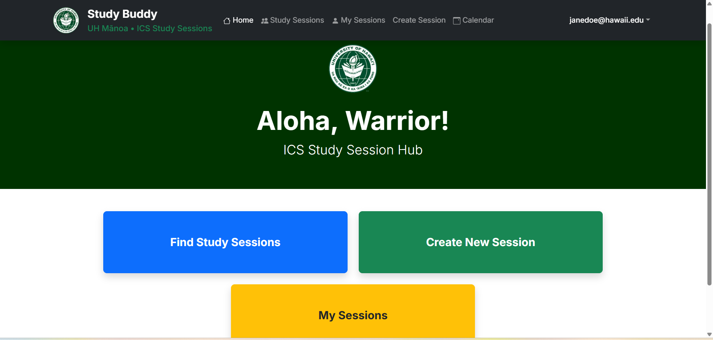
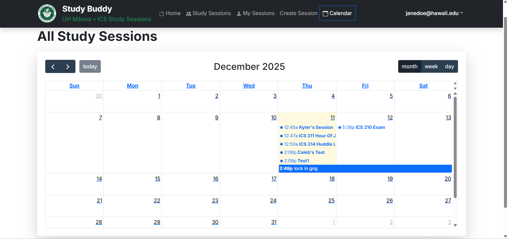

## Overview

Study Buddy is a full-stack collaborative web application built for University of Hawaiʻi at Mānoa ICS students to find and organize in-person study sessions in ICSpace. Students register as a "sensei" (able to help in certain courses) or "grasshopper" (seeking help), create and join study sessions, and browse upcoming sessions via a calendar view. The app restricts access to UH-affiliated accounts and promotes productive peer-to-peer learning.

## My Contributions

Built as a team of 3 using Issue-Driven Project Management on GitHub across three milestone sprints:
- Designed and implemented user profile management, including course selection, sensei/grasshopper role assignment, and profile photo uploads.
- Integrated Google OAuth 2.0 authentication restricted to @hawaii.edu accounts.
- Built session creation forms with validation and real-time calendar integration using the Google Calendar API.
- Wrote end-to-end tests using Playwright and enforced code quality with ESLint and Prettier.
- Participated in milestone planning, code reviews, and production deployment to Vercel.

## What I Learned

- Full-stack development with Next.js, TypeScript, and Prisma ORM connected to PostgreSQL.
- Modern authentication flows and security best practices with OAuth 2.0.
- Agile methodologies, collaborative Git workflows, and professional CI/CD deployment pipelines.
- The value of automated testing and clean, maintainable code in a team environment.
- User-centered design through iterative feedback from real UH students.

## Technologies Used

Next.js, React, TypeScript, Bootstrap, Prisma, PostgreSQL, Google OAuth 2.0, Playwright, Vercel

## Links

- [GitHub Repository](https://github.com/Study-Buddy-G2S6/study-buddy)
- [Live Application](https://study-buddy-flax-ten.vercel.app/)
- [Project Documentation](https://study-buddy-g2s6.github.io/)

## Screenshots

*Dashboard after successful login*

*Calendar view showing available study sessions*
