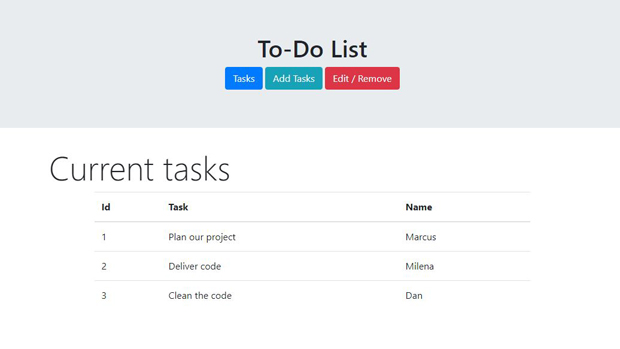

## Overview

A lightweight, responsive to-do list app that allows users to add, edit, mark as complete, and delete tasks. All tasks are saved automatically to the browser's localStorage, ensuring persistence across sessions. This project demonstrates core front-end skills without relying on any external libraries or frameworks.

## My Contributions

Solo project from start to finish:
- Created a clean, mobile-friendly UI with HTML and Bootstrap styling.
- Implemented full task CRUD operations entirely in vanilla JavaScript.
- Added task editing, completion toggling, and automatic persistence across sessions.
- Ensured smooth user experience with instant updates and no page reloads.

## What I Learned

- DOM manipulation, event delegation, and dynamic element creation.
- Using localStorage for client-side data persistence.
- Structuring maintainable JavaScript with modular functions.
- Building fully functional apps with only native web technologies — solid preparation for framework-based development.

## Technologies Used

HTML, CSS (Bootstrap), Vanilla JavaScript

## Snapshot

