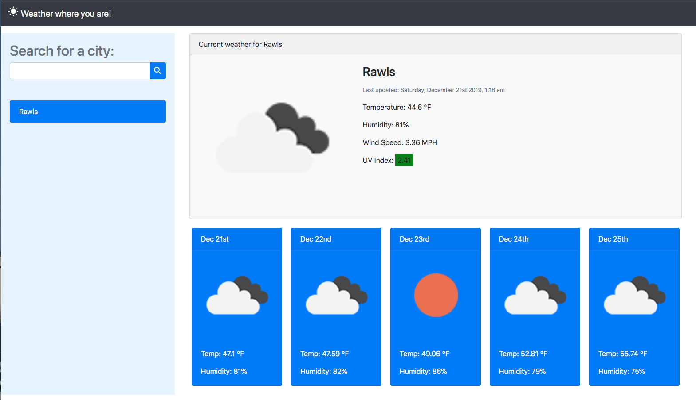

## Overview

A single-page web application that allows users to search any city worldwide and view real-time current weather conditions plus a detailed 5-day forecast. Features include temperature, humidity, wind speed, weather icons, and persistent search history.

## My Contributions

Solo project from concept to deployment:
- Designed a responsive layout using Bootstrap cards.
- Integrated asynchronous API calls to OpenWeatherMap's current weather and forecast endpoints.
- Dynamically generated forecast cards with proper date formatting and weather icons.
- Implemented search history saved to localStorage with clickable recent searches.

## What I Learned

- Working with third-party REST APIs and handling JSON responses.
- Asynchronous JavaScript using fetch, async/await, and error handling.
- Manipulating dates with JavaScript's Date object and Unix timestamps.
- Building dynamic, reusable UI components without a framework.

## Technologies Used

HTML, CSS (Bootstrap), Vanilla JavaScript, OpenWeatherMap API

## Snapshot

